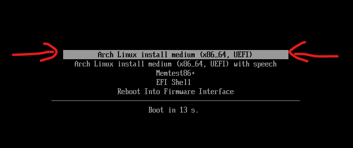
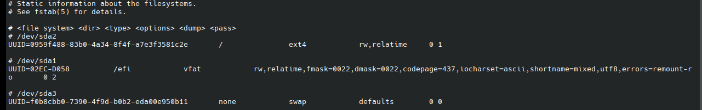

<style>
  .heimu, .heimu a, a .heimu, .heimu a.new {
      background-color: #252525;
      color: #252525; /* 初始颜色与背景相同，文字不可见 */
      text-shadow: none;
      transition: color 0.5s ease-in-out;
  }
  </style>
  <style>
  .heimu:hover, .heimu:active,
  .heimu:hover .heimu, .heimu:active .heimu {
    color: white !important;
  }
  </style>
  <style>
  .heimu:hover a, a:hover .heimu,
  .heimu:active a, a:active .heimu {
    color: lightblue !important;
  }
  </style>
  <style>
  .heimu:hover .new, .heimu .new:hover, .new:hover .heimu,
  .heimu:active .new, .heimu .new:active, .new:active .heimu {
    color: #BA0000 !important;
  }
</style>

## 前言

:::important
 - 本教程第一次考虑的那么全面，但仍然可能会有不足的地方（包括表述等方面），让我们一起继续完善这篇教程吧！
 - 反馈方式：写在底下的Giscus评论区里
:::

之前的博文只提供了虚拟机的安装方法，考虑到物理机的操作会有所不同，决定完全重新写一篇安装教程，并且更加完善之前所遗漏的东西。

## 介绍

`Arch Linux` 是一种通用操作系统，它是基于 x86-64 架构的一类 GNU/Linux 发行版。

`Arch Linux` 采用滚动发行模式，尽全力为用户提供最新的稳定版软件。初始安装完成的 `Arch Linux` 只是一个基本系统，随后用户可以根据自己的喜好安装需要的软件并配置成符合自己理想的个性化系统。

`Arch Linux` 秉持的核心原则是`"Keep It Simple, Stupid"`(对应中文为`“保持简单，且一目了然”`)。

——选自[Arch Linux 中文维基](https://wiki.archlinuxcn.org/wiki/Arch_Linux)

## 准备工作

### 要求

#### 一、 物理机硬件要求

 1. 有一台能用的电脑！
 <span class="heimu" title="你知道的太多了">~~(如果你的电脑在此之前就有一堆硬件问题，比如开机没几秒就熄灯之类的，那么你要不拿去修理要不换一台电脑)。~~</span><span class="heimu" title="你知道的太多了">~~(如果你没有一台电脑，是手机用户，那请退出这个网站，买一台电脑再来，或者使用Termux运行Linux虚拟机)。~~</span>

 2. 你的主板支持UEFI启动。<span class="heimu" title="你知道的太多了">~~(在当今UEFI普及的时代，很多教程都以UEFI+GPT方式安装，如果你的电脑不支持UEFI启动，说明你的电脑很老了，请换一台电脑)。~~</span>

 3. 至少 4GB 的 DDR3 内存，推荐 8GB DDR4 以上。<span class="heimu" title="你知道的太多了">~~DDR2内存用户请自觉退出该页面（。~~</span>

 4. 至少 20GB HDD的硬盘空间，推荐 120GB SSD以上(较普遍的固态硬盘的容量)。

 5. 有较强的网络环境，推荐千兆网线或者千兆 WiFi 6 无线网卡(比如Intel 的 AX210)<span class="heimu" title="你知道的太多了">~~(如果你的光猫宽带不支持千兆，虽然能继续跟着教程安装，但是拉取仓库的速度就很不理想了，只要你能忍受就行)。~~</span>

 6. CPU为x86_64架构(Intel 或 AMD)，只要能安装就行。~~ARM平台的CPU请查阅其他教程~~

 7. 显卡可以核显 ~~(就是GUI有点卡)~~ 或者独显(NVIDIA 或 AMD 显卡)。

#### 二、 虚拟机软件要求

 1. 你的物理机支持虚拟化技术，如果默认不开启需要在固件设置<span class="heimu" title="你知道的太多了">(人话就是BIOS设置但是是在UEFI平台上的称呼)</span>中找到类似`"Intel Virtual Technology"`和`"VT-d"`字样，选择`"enable"`（AMD平台的为`"AMD-V"`字样）。

 2. 虚拟机软件为`VMware Workstation Pro` 或 `VirtualBox`，推荐安装最新版本。

 3. 至少 4GB 的内存，推荐 8GB 以上。

 4. 至少 20GB SCSI的硬盘空间，推荐 120GB SATA以上。

 5. 至少 2个CPU核心，推荐 4个以上。

#### 三、 其他要求

 - 物理机安装还需要另外准备一个可读写的U盘，用来引导`Arch Linux`安装盘。

 - 需要用户有一定的Linux基础，包括命令行操作、文件管理、软件安装等。
 <span class="heimu" title="你知道的太多了">(如果你是一位完全不会Linux的新手，建议你尝试其他的发行版吧，比如常用的Ubuntu，Mint，Fedora等，先在虚拟机或者WSL2上体验一下再来考虑要不要安装)</span>

 - 需要用户有一定的命令行基础！<span class="heimu" title="你知道的太多了">(如果你是Windows用户，并且你从来没碰过cmd和powershell，也比较讨厌命令行操作，只会桌面操作，建议你关闭该教程，继续使用Windows，因为Linux很多时候需要命令行操作，这都一点不会还不如继续保持Win，别来折磨自己（（（)</span><span class="heimu" title="你知道的太多了">(或者你无视我的提醒，用户：我埃及吧怎样用就怎样用（（（)</span>

 - 参考：https://arch.icekylin.online/guide/prepare/head-on-blow.html

### 准备安装介质

#### 一、 获取安装镜像

`Arch Linux`系统的安装需要一个ISO镜像文件，可以从[官网下载](https://archlinux.org/download/)，但国内的网络环境推荐去开源镜像站下载，这里列出了一些国内镜像站。

 - TUNA镜像源：https://mirrors.tuna.tsinghua.edu.cn/archlinux/iso/latest/

 - 北外镜像源：https://mirrors.bfsu.edu.cn/archlinux/iso/latest/

 - 中科大源：https://mirrors.ustc.edu.cn/archlinux/iso/latest/

 - 浙大源：https://mirrors.zju.edu.cn/archlinux/iso/latest/

进入网页后，点击类似`"archlinux-[年份].[月份].[日期]-x86_64.iso"`的链接下载镜像文件，推荐使用`FDM`或者`AB Download Manager`下载。

#### 二、 制作U盘启动盘

:::caution
<font color="red" size="5">注意在此之前先备份一下U盘上的重要数据！！！</font>

<font color="red" size="5">注意在此之前先备份一下U盘上的重要数据！！！</font>

<font color="red" size="5">注意在此之前先备份一下U盘上的重要数据！！！</font>

<span class="heimu" title="你知道的太多了">重要的事情说三遍！！！</span>
:::

#### 1. Balena Etcher

下载完ISO镜像文件后，使用[Rufus](https://rufus.ie/zh/)工具或者[Balena Etcher](https://www.balena.io/etcher/)工具制作U盘启动盘。

这里以`Balena Etcher`为例：

插入U盘后，打开`Balena Etcher`，选择"从文件烧录"，选择下载好的ISO镜像文件。

然后点击"选择目标磁盘"，找到你插入的U盘。


<center><font color="#A9A9A9">选择目标U盘</font></center>

点击"现在烧录!"

等进度条过完以后，U盘启动盘就制作好了。

--------

#### 2. Ventoy

或者使用[Ventoy](https://www.ventoy.net/cn/)工具制作U盘启动盘。

打开`Ventoy`，先在配置选项-分区类型选择GPT，默认选中了你的U盘，然后点击"安装"按钮，期间会反复确认是否格式化U盘，点击"是"即可。


<center><font color="#A9A9A9">分区格式选择GPT</font></center>

之后把ISO镜像拖入到名为"Ventoy"的分区中即可。

#### Balena Etcher与Ventoy对比

`Balena Etcher`和`Rufus`一样只能使用一个ISO镜像文件制作U盘启动盘；

而`Ventoy`只需要安装进U盘里，之后可以直接导入多个ISO镜像文件，比如各种PE，各个发行版Live CD等，还可以配合[Edgeless](https://home.edgeless.top/)这种高度定制的PE系统使用。

所以我个人推荐使用`Ventoy`。

### 虚拟机安装的准备

以`VMware Workstation Pro`为例，创建虚拟机

点击"创建新的虚拟机"，选择"自定义(高级)"。


<center><font color="#A9A9A9">创建虚拟机</font></center>

虚拟机硬件兼容性保持默认，点击"下一步"，选择"安装程序光盘映像文件(iso)"，选择下载好的ISO镜像文件。


<center><font color="#A9A9A9">选择安装镜像文件</font></center>

点击"下一步"，操作系统选择"Linux",版本选择"其他 Linux 6.x 内核 64 位"


<center><font color="#A9A9A9">选择操作系统</font></center>

点击下一步，编辑虚拟机名称和位置


<center><font color="#A9A9A9">编辑虚拟机名称和位置</font></center>

选择处理器数量，建议为1个处理器数量和4个核心，然后分配内存，内存建议为4GB以上。


<center><font color="#A9A9A9">选择CPU核心数和分配内存</font></center>

网络类型默认选择"使用网络地址转换(NAT)"，点击下一步，选择I/O控制器类型，保持默认点击下一步，虚拟磁盘类型选择"SATA"或者"NVMe"，点击下一步选择创建新虚拟磁盘，指定磁盘容量自定，下边保持默认。


<center><font color="#A9A9A9">自定磁盘容量</font></center>

点击"下一步"，最后检查设置，确保所有设置正确无误，点击"完成"，虚拟机创建完成。


## 安装Arch Linux

:::caution
在这里请谨慎地操作每一步，错了一条命令可能会造成轻度或严重后果，虚拟机可以直接复制以下给出的命令，在左上角找到`编辑-粘贴`就可以把物理机复制的东西粘贴到虚拟机里执行。
:::

### 一、 启动

#### 物理机的启动

先把电脑重启，然后按快捷键进入选择启动项界面(Boot Menu)(这里不同品牌的主板和笔记本都有不同的进入启动项的快捷键，请自行必应搜索，我用的联想笔记本进入启动项的快捷键是`F12`)

选择你新安装的U盘启动项(一般是`[启动项名称]+(你的U盘设备名)`)，如果找不到请尝试搜索如何解决。

进入Arch Linux Live CD引导界面，选择`"Arch Linux install medium (x86_64, UEFI)"`回车。 ~~(第一个就是了直接Enter回车)~~



<center><font color="#A9A9A9">Choose This!</font></center>

进入满屏的跑代码界面几十秒后，就会成功进入Arch Live CD的命令行交互环境，下面是你能输入的那一行的标识：

```
root@archiso ~ #
```

在这里，`root`是超级用户，`archiso`是Live CD的hostname，`~`是当前用户的家目录，`#`是root用户提示符(相反`$`表示普通用户)，你可以输入命令，按`Enter`键执行。

#### 虚拟机的启动

找到新建的虚拟机，点击`编辑虚拟机设置-硬件-CD/DVD`，选择下载好的ISO镜像文件，勾选`启动时连接`。


<center><font color="#A9A9A9">选择ISO镜像文件</font></center>

然后点击`选项`菜单，找到`高级`，在`固件类型`中选择`UEFI`，然后点击`确认`按钮。<span class="heimu" title="你知道的太多了">(当然虚拟机的话BIOS也是行的（（（)</span>


<center><font color="#A9A9A9">选择UEFI固件类型</font></center>

最后点击`开启此虚拟机`按钮，虚拟机就会启动，进入Arch Linux Live CD的命令行交互环境。

### 二、 禁用非必要的服务和module

#### 1. 禁用Reflector服务

:::tip
 - 输入命令时可以使用`Tab`补全以方便使用。
 - 如果屏幕被一堆输出占满了，可以使用`clear`命令清屏。
:::

2020 年，`Arch Linux`安装镜像中加入了`reflector`服务，它会自己更新`mirrorlist`（软件包管理器`pacman`的软件源）。在特定情况下，它会误删某些有用的源信息。这里进入安装环境后的第一件事就是将其禁用。也许它是一个好用的工具，但是很明显，因为地理上造成的特殊网络环境，这项服务并不适合启用。

通过以下命令停止并禁用`reflector`服务：

```bash
systemctl stop reflector.service
systemctl disable reflector.service
# 通过底下的命令检查服务状态，查看该服务是否被禁用，按下 q 退出结果输出
systemctl status reflector.service
```

#### 2. 禁用蜂鸣器

我们在安装过程中如果输入命令输错了退格或者`Tab`键无法补全时，如果全部字符已经删除，那么就会发出刺耳的蜂鸣器声音，这时我们可以禁用蜂鸣器。

```bash
rmmod pcspkr
echo "blacklist pcspkr" >> /etc/modprobe.d/blacklist.conf
```

### 三、 确认启动方式

在安装之前，教程提到必须使用UEFI启动方式，让我们来先验证一下Live CD的启动方式。

```bash
ls /sys/firmware/efi/efivars   # 如果有这个目录，说明是UEFI启动方式
# 或者
cat /sys/firmware/efi/fw_platform_size
```

前者输出为一堆目录(`efi`变量)，说明你是UEFI的启动方式，否则就是BIOS的启动方式；

后者如果返回`64`，那么系统以 UEFI 模式启动，并且有 64 位 UEFI。如果返回`32`，那么系统以 UEFI 模式启动，但是只能使用`GRUB`作为引导加载程序。如果这个文件不存在，系统可能以 BIOS 模式启动。

BIOS启动方式的读者，物理机请尝试使用UEFI启动方式，虚拟机可以继续查阅下一步的安装步骤（但有些步骤需要自己修改，不知道的请查阅官方Wiki或者问群u）。

### 四、 连接网络

在安装Arch Linux之前，请确保你的电脑已经连接到网络，并且可以正常上网。

#### 1. WIFI无线连接

查看内核是否加载了无线网卡驱动：

```bash
lspci -k | grep Network
```

如果你的固件设置没有开启无线网卡的开关可以参考下列的命令来开启WIFI：

```bash
rfkill list #查看无线连接 是否被禁用(blocked: yes)
ip link
ip link set wlan0 up #比如无线网卡看到叫 wlan0

# 若看到类似Operation not possible due to RF-kill的报错，继续尝试rfkill unblock wifi来解锁无线网卡。

rfkill unblock wifi
```

 > 部分无线网卡不兼容，请考虑使用有线连接安装Arch Linux。

如果你的无线网卡可以正常工作，那么使用`iwctl`命令连接WIFI：

```bash
iwctl # 进入交互式命令行
device list # 列出无线网卡设备名，比如无线网卡看到叫 wlan0
station wlan0 scan # 扫描网络
station wlan0 get-networks # 列出所有 wifi 网络
station wlan0 connect [wifi-name] # 进行连接，注意这里无法输入中文。回车后输入密码即可
exit # 连接成功后退出
```

#### 2. 有线连接

如果你使用网线连接电脑，正常来说，只要插上一个已经联网的路由器分出的网线（DHCP），直接就能联网。

可以等待几秒等网络建立连接后再进行下一步测试网络的操作。

若笔记本没有网线接口请使用带网线接口的扩展坞。

如果你的网线连接失败，请重启DHCP服务：

```bash
systemctl restart dhcpcd.service
systemctl restart NetworkManager.service # 如果有
```

### 五、 确认网络连接

确认网络连接是否正常，可以使用`ping`命令测试网络连接。

```bash
ping -c8 cn.bing.com # 测试网络连接
```

在这里，`-c`参数指定了发送的请求数，`8`表示发送8个请求，`cn.bing.com`是微软必应搜索引擎的域名。

稍等片刻，若能看到数据返回，即说明已经联网。

如果提示超时，请重新检查网络是否连接正常。

如果没有自定义参数直接使用`ping`命令，那么就会一直持续发送数据包，这时请按下`Ctrl+C`终止程序。

### 六、 更新系统时钟

使用`timedatectl`确保系统时间是准确的。这一步不是可选的，正确的系统时间对于部分程序(比如pacman验证软件包的签名等)来说非常重要：

```bash
timedatectl set-ntp true # 将系统时间与网络时间进行同步
timedatectl status # 查看系统时间，或者使用 date 命令查看
```

时间可能以 UTC 时区显示，比北京时间慢 8 小时。这是正常现象，无需调整。

### 七、 更换国内软件仓库镜像源

我们使用编辑器编辑`/etc/pacman.d/mirrorlist`文件：

```bash
nano /etc/pacman.d/mirrorlist 
# 可以使用vim，但在此之前请先安装，因为livecd环境没有自带vim
```

写入以下内容：

```plaintext
Server = https://mirrors.tuna.tsinghua.edu.cn/archlinux/$repo/os/$arch
Server = https://mirrors.bfsu.edu.cn/archlinux/$repo/os/$arch
Server = https://mirrors.ustc.edu.cn/archlinux/$repo/os/$arch
Server = https://mirrors.zju.edu.cn/archlinux/$repo/os/$arch
```

保存并退出，如果使用的是nano编辑器，按下`Ctrl+O`保存，按`Y`确认，再按`Ctrl+X`退出；vim则按`Esc`退出编辑模式，输入`:wq`保存并退出。

之后执行命令，更新pacman软件源：

```bash
pacman -Sy
```

### 八、 检查磁盘分区情况

在正式安装之前，我们先使用`lsblk`或`fdisk -l`命令查看当前磁盘分区情况：

```bash
lsblk # 查看所有磁盘分区
fdisk -l # 或者
```

如果你是物理机，那么类似输出如下：

```bash
root@archiso ~ # lsblk
NAME           MAJ:MIN  RM    SIZE  RO  TYPE  MOUNTPOINT
loop0            7:0     0  688.2M   1  loop  /run/archiso/airootfs  # loop0 是注入到内存的Live CD环境，请忽略
sda              8:0     0    436G   0  disk  # sda 是要安装 Arch Linux 的硬盘，请记住设备名
sdb              8:2     0    936G   0  disk  # sdb 是扩展硬盘，请忽略
└─sdb1           8:11    0    936G   0  part  
sdc              8:16    1   59.8G   0  disk  # sdc 是 U 盘启动盘，请忽略
├─sdc1           8:17    1   59.7G   0  part
│   └ventoy    254:0     0  861.3M   1  dm    /run/archiso/bootmnt
└─sdc2           8:18    1     32M   0  part
nvme0n1         259:0    0    120G   0  disk  # nvme0n1 是 Windows 系统的硬盘，请忽略
├─nvme0n1p1     259:1    0     16M   0  part  Microsoft reserved partition
└─nvme0n1p2     259:2    0    119G   0  part  Microsoft basic data partition
```

如果你是虚拟机，那么类似输出如下：

```bash
root@archiso ~ # lsblk
NAME           MAJ:MIN  RM    SIZE  RO  TYPE  MOUNTPOINT
loop0            7:0     0  688.2M   1  loop  /run/archiso/airootfs  # loop0 是注入到内存的Live CD环境，请忽略
sda              8:0     0    135G   0  disk  # sda 是要安装 Arch Linux 的硬盘，请记住设备名
sr0             11:0     1  755.3M   0  rom   /run/archiso/bootmnt  # sr0 是VMware虚拟光驱，请忽略
```

我们可以看到，形如`sdX`是SATA硬盘，形如`nvmeXn1`是NVMe固态硬盘，以上的举例与实际安装输出的有所不同，请根据实际情况自行决定。

这篇教程就以`sda`为例，介绍如何分区和格式化硬盘（不同情况视自己的选择）。

还有，使用物理机的读者，<font color="red" size="5">你不要不小心把Windows系统的硬盘也格式化了！</font>

### 九、 开始分区

:::caution
分区操作的部分命令具有危险性！除非你知道每一个命令在干什么，否则请不要执行！

同时，

<font color="red" size="5">请提前做好数据备份，防止数据丢失！</font>

<font color="red" size="5">请提前做好数据备份，防止数据丢失！</font>

<font color="red" size="5">请提前做好数据备份，防止数据丢失！</font>

<span class="heimu" title="你知道的太多了">还是重要的事情说三遍……</span>
:::

#### 1. 使用fdisk命令分区

 > 如何学习使用fdisk，敬请参阅：https://wiki.archlinuxcn.org/wiki/Fdisk

输入以下命令，进入fdisk命令行：

```bash
fdisk /dev/sda
fdisk /dev/nvme0n1 # 或者
```

 - 第一步，按下`g`键，新建GPT分区表；
 - 第二步，按下`n`键，`作为你的EFI分区`第一个提示你分区编号，默认`Enter回车`，第二个提示你扇区起始位置，默认`Enter回车`，第三个提示你分区大小，输入`+512M`，回车，如果最后提示你需要清除已有签名，输入`y`回车；
 - 第三步，按下`t`键，选择分区类型，输入`1`，回车，代表EFI系统分区，有时候`1`并不代表这样，请输入`L`查看已知的分区类型，输入对应的编号回车；
 - 第四步，`作为你的根目录主分区`，重复第二步的步骤，前面保持默认，提示你分区大小时输入合适的大小，至少`64G`，分区类型选择`83`，代表Linux文件系统；
 - 第五步，`作为Swap交换分区`，大小在`4G~8G`之间较为合适，分区类型选择`82`，代表Linux swap分区；
 - 第六步，输入`p`打印分区表，检查有没有问题，输入`w`保存并退出。
 -  ```plaintext
    ...
    Device        Start        End   Sectors   Size  Type
    /dev/sda1      2048    1050623   1048576   512M  EFI System
    /dev/sda2   1050624   42993663  41943040    64G  Linux root (x86-64)
    /dev/sda3  42993664  125827071  82833408     4G  Linux swap
    ...
    ```

如有疑问，请参阅上面给出的链接。

#### 2. 使用cfdisk命令分区

cfdisk是提供CUI界面的分区工具，可以较为直观地进行分区操作。

如果是新安装的磁盘，进入cfdisk之后会提示选择分区表类型，选择`gpt`。

 - 第一步，选择`New`，新建一个分区，选择`Primary`，大小为`512M`，按下回车确认，选择`Type`，分区类型选择`EFI System`;
 - 第二步，选择`New`，新建一个分区，选择`Primary`，大小为`64G`，按下回车确认，分区类型选择`Linux filesystem`;
 - 第三步，选择`New`，新建一个分区，选择`Primary`，大小为`4G`，按下回车确认，分区类型选择`Linux swap`;
 - 第四步，选择`Write`，输入`yes`，保存，然后选择`Quit`，退出。

如有疑问，请查阅同Fdisk给出的链接。

#### 3. 使用parted/gparted命令分区

 > 请参阅：https://wiki.archlinuxcn.org/wiki/Parted

### 十、 格式化分区

复查一下分区情况：

```bash
NAME           MAJ:MIN  RM    SIZE  RO  TYPE  MOUNTPOINT
loop0            7:0     0  688.2M   1  loop  /run/archiso/airootfs  
sda              8:0     0    135G   0  disk  
├─sda1           8:1     0    512M   0  part  EFI System
├─sda2           8:2     0     64G   0  part  Linux root (x86-64)
└─sda3           8:3     0      4G   0  part  Linux swap
sr0             11:0     1  755.3M   0  rom   /run/archiso/bootmnt
```

我们可以看到，`sda1`是EFI系统分区，`sda2`是根目录主分区，`sda3`是Swap交换分区。

接下来，我们将格式化这三个分区：

 - 格式化`sda1`为`FAT32`格式：

   ```bash
   mkfs.vfat -F 32 -n boot /dev/sda1
   ```
 - 格式化`sda2`为`ext4`或者`btrfs`格式：

   ```bash
   mkfs.ext4 -L Arch /dev/sda2
   # 或者
   mkfs.btrfs -L Arch /dev/sda2
   ```
 - 格式化`sda3`为`swap`格式：

   ```bash
   mkswap -L swap /dev/sda3
   ```

 > 关于mkfs命令的详细用法，请参阅：https://wiki.archlinuxcn.org/wiki/%E6%96%87%E4%BB%B6%E7%B3%BB%E7%BB%9F

### 十一、 挂载分区

:::important
虽然EFI分区可以挂载到`/mnt/boot`目录，但现如今的教程已不建议这样做，很多时候都建议挂载到`/mnt/efi`目录下。
:::

接下来，我们将挂载分区：

```bash
mount /dev/sda2 /mnt
mkdir /mnt/efi
mount /dev/sda1 /mnt/efi
swapon /dev/sda3
```

我们可以看到，我们将`sda2`挂载到`/mnt`，`sda1`挂载到`/mnt/efi`，`sda3`挂载到Swap分区。

复查挂载情况：

```bash
df -h # 查看磁盘挂载情况
free -h # 查看Swap分区有没有正常挂载，-h 选项会使输出以人类可读的单位显示
```

### 十二、 安装基本系统

通过如下命令使用`pacstrap`脚本安装基础包：

```bash
pacstrap /mnt base base-devel linux linux-firmware
```
:::tip
说明：
 - `base`：最基本的系统工具
 - `base-devel`：包含了开发环境的工具，在`AUR`包的安装过程中是必须用到的
 - `linux`：包含了Linux内核，如果你是新手，可以不用安装其他内核
 - `linux-firmware`：包含了Linux的驱动程序，比如网卡驱动、声卡驱动等
:::

如果你想安装其他内核，可以看看列举出来的内核说明：
 - `linux-zen`：一些内核黑客合作的结果，提供了最适合日常使用的内核，优化了部分性能。
 - `linux-headers`：即Linux内核头文件，是一组包含各种头文件的集合，这些头文件为设备提供了本地编译驱动的能力，zen内核也有提供`linux-zen-headers`内核。
 - `linux-hardened`：注重安全的 Linux 内核，采用一系列加固补丁以缓解内核和用户空间漏洞。和`linux`相比，它启用了上游更多的内核加固功能。
 - `linux-lts`：长期支持版本的 Linux 内核，通常比最新版本稳定，适合长期使用。
 - 此外还有其他内核可以选择，敬请参阅：https://wiki.archlinuxcn.org/wiki/%E5%86%85%E6%A0%B8

并且`pacstrap`脚本除了安装内核基本包，也可以安装软件，这样就不用在`chroot`环境下手动安装软件了，例如：

```bash
pacstrap /mnt nano vim sudo grub efibootmgr networkmanager intel-ucode
```

安装基本系统根据个人喜好而定，这是我个人的安装命令：

```bash
pacstrap /mnt base base-devel linux linux-firmware linux-zen linux-headers linux-zen-headers nano vim sudo grub efibootmgr networkmanager intel-ucode
```

### 十三、 生成fstab文件

Fstab文件是Linux系统中重要的配置文件，它描述了文件系统的挂载信息，以及在系统启动时需要挂载的文件系统。

很久以前，Fstab文件需要我们手动编辑，它的格式也比较麻烦，好在Arch Linux提供了`genfstab`脚本，便于我们生成Fstab文件。

```bash
genfstab -U /mnt >> /mnt/etc/fstab
```

`-U`选项表示生成的Fstab文件中不包含UUID信息，因为UUID信息可能与硬盘有关，如果硬盘更换，UUID也会发生变化，这会导致Fstab文件失效。

记得检查`Fstab`文件是否正确，确保它包含了所有需要挂载的分区，并且挂载信息正确。



<center><font color="#A9A9A9">Fstab文件示例</font></center>

 > 更多相关信息，请参阅：
   - Fstab：https://wiki.archlinuxcn.org/wiki/Fstab
   - Genfstab：https://wiki.archlinuxcn.org/wiki/Genfstab

### 十四、 切换到新系统

原本的`chroot`命令在此之前需要挂载很多必要的文件系统，至少需要五六条命令才能正常使用chroot环境，非常繁琐<span class="heimu" title="你知道的太多了">，不信给你康康</span>：

```bash
mount -t proc /proc /mnt/proc
mount -t sysfs /sys /mnt/sys
mount --rbind /dev /mnt/dev
# 可选  mount --rbind /run /mnt/run
# 如果正运行在 UEFI 系统，则还需要能够访问 EFI 变量
mount --rbind /sys/firmware/efi/efivars sys/firmware/efi/efivars/
# 如果已经建立了一个网络连接并且想在 chroot 环境中继续使用，将 DNS 服务器配置复制到新环境：
cp -L /etc/resolv.conf etc/resolv.conf
# 最后，切换到新系统并启用指定Shell：
chroot /mnt/arch /usr/bin/bash
```

好在Arch Linux提供了`arch-chroot`脚本，简化了以上的命令，让我们更灵活地切换到新环境中：

```bash
arch-chroot /mnt /bin/bash
```

 > 敬请参阅：https://wiki.archlinuxcn.org/wiki/Chroot

### 十五、 新系统的基本配置

#### 1. 设置时区

```bash
timedatectl set-ntp true # 启用网络时间同步
ln -sf /usr/share/zoneinfo/Asia/Shanghai /etc/localtime # 设置时区为上海
hwclock --systohc # 将系统时间写入硬件时钟
```

#### 2. 设置主机名(以`lingxi9374-ArchPC`为例)

```bash
echo 'lingxi9374-ArchPC' > /etc/hostname # 设置主机名为lingxi9374-ArchPC
```

#### 3. 设置locale

`Locale`决定了软件使用的语言、书写习惯和字符集。

如果你没有安装编辑器，输入下面命令安装：

```bash
pacman -S vim nano
```

:::note
`vim`基本使用操作：
 - 1. `"/"`键进入搜索模式，输入要搜索的单词，回车，可以搜索到相关内容。
   2. 按`"i"`键进入编辑，`Esc`键退出编辑，
   3. `"x"`键去除文字，
   4. 输入`":wq"`保存并退出，后面加`"!"`表示强制执行。
   5. 键入`"yy"`复制行
   6. 键入`"dd"`剪切行，`"2dd"`为剪切两行
   7. 键入`"p"`黏贴行
   8. 键入`"d$"`复制光标后面半行
 - 目前我还不怎么熟悉使用vim，有些是从网上找来的以及某群群u说的（
 - 如果以后学会了我也会写一篇博文谈谈vim的使用技巧（画大饼.jpg）
:::

使用`vim`编辑`/etc/locale.gen`文件，将`"en_US.UTF-8"`和`"zh_CN.UTF-8"`前面的`"#"`号去掉，保存修改并退出，确保看起来如下：

```plaintext
...
en_US.UTF-8 UTF-8
...
zh_CN.UTF-8 UTF-8
...
```

然后执行以下命令生成`locale`，并设置`LANG`环境变量：
```bash
locale-gen
echo LANG=en_US.UTF-8 > /etc/locale.conf
# 不推荐LANG设置中文，因为在tty环境中会导致乱码
```
#### 4. 创建用户

执行以下命令创建用户(以`"lingxi"`为例)：
```bash
useradd -m -g users -G wheel lingxi
```

在此命令中，`-m`选项表示创建用户时同时创建用户主目录，`-g`选项指定用户主目录所属的组为`users`，`-G`选项指定用户所属的附加组为`wheel`。

#### 5. 设置用户密码和root密码
执行以下命令设置用户密码和root密码(以`"lingxi"`为例)：

```bash
passwd lingxi
passwd root
```

请注意：设置密码时输入字符不会显示输入的个数，也就是星号出来，请不要慌张，这是Linux特有的安全机制，这个安全机制可以防止你附近的人猜测密码长度。

#### 6. 给予用户sudo权限

执行以下命令给予用户`sudo`权限：

```bash
EDITOR=vim visudo
#或者
vim /etc/sudoers
```

找到`# %wheel ALL=(ALL:ALL) ALL`这一行，将注释去掉，保存并退出。

再次确认一下文件修改对不对：

```bash
...
%wheel ALL=(ALL:ALL) ALL
...
```

#### 7. 配置hosts文件

编辑`/etc/hosts`文件，添加以下内容：

```plaintext
127.0.0.1   localhost
::1         localhost
127.0.1.1   lingxi9374-ArchPC.localdomain lingxi9374-ArchPC
```

 > 请注意：
   - `127.0.0.1`和`::1`是本地回环地址，`localhost`是主机名，`lingxi9374-ArchPC.localdomain`是主机名的备用域名，`lingxi9374-ArchPC`是主机名。
   - 请不要修改`127.0.1.1`这一行，否则可能会导致网络无法正常连接。

#### 8. 启用网络服务

执行以下命令启用`Network Manager`网络服务：

```bash
pacman -S networkmanager
systemctl enable NetworkManager.service
```

#### 9. 安装微码

查看您的CPU型号：

```bash
cat /proc/cpuinfo | grep "model name"
```

通过以下命令安装对应芯片制造商的微码：

```bash
pacman -S intel-ucode # Intel CPU
pacman -S amd-ucode # AMD CPU
```

#### 10. 安装引导程序

`GRUB`（GRand Unified Bootloader，大一统启动加载器）是一个用于加载和管理系统启动的完整程序。它是 Linux 发行版中最常见的引导程序(bootloader)。引导程序是计算机启动时运行的第一个软件。它加载 操作系统的内核，然后再由内核初始化操作系统的其他部分（包括 Shell、显示管理器、桌面环境 等等）。

通过以下命令安装`GRUB`：

```bash
pacman -S grub efibootmgr os-prober
```

说明：
 - `efibootmgr`——`efibootmgr`被`grub`脚本用来将启动项写入`NVRAM`
 - `os-prober`——为了能够引导Win10，需要安装`os-prober`以检测到它，虚拟机不用安装

安装`GRUB`到EFI分区：

```bash
grub-install --target=x86_64-efi --efi-directory=/efi --bootloader-id=GRUB --removable
# 说明：
# --target 指定目标平台为x86_64-efi
# --efi-directory 指定EFI分区的路径
# --bootloader-id 指定引导程序的ID
# --removable 选项表示安装到可移动设备上，可不选
```

若输出为：
```plaintext
Installing for x86_64-efi platform.
Installation finished. No error reported.
```

则表示安装成功。

#### 11. 配置GRUB

编辑`/etc/default/grub`文件，将`"GRUB_TIMEOUT=5"`修改为`"GRUB_TIMEOUT=30"`；

将`"GRUB_CMDLINE_LINUX_DEFAULT="`后面的参数修改为`"loglevel=5 nowatchdog"`。
<span class="heimu" title="你知道的太多了">当然你也可以修改为"loglevel=7"使用最高日志等级来装逼，这将会输出全部内核日志</span>

最终修改如下：

```plaintext
GRUB_TIMEOUT=30
GRUB_CMDLINE_LINUX_DEFAULT="loglevel=5 nowatchdog"
```

保存并退出。

生成`grub`配置文件：

```bash
grub-mkconfig -o /boot/grub/grub.cfg
```

如果使用物理机双系统，生成配置文件时检测不到NTFS分区，请试着使用搜索引擎得到解决方案，或者问问群u。

### 十六、 重启系统

退出`chroot`环境：
```bash
exit # 或者键入Ctrl+D
```

关闭`swap`:

```bash
swapoff /dev/sda3
```

取消挂载分区：

```bash
umount -R /mnt
```

重启系统：

```bash
reboot
```

重启之后，电脑应该会首先进入GRUB引导界面，选择你刚才安装的系统，然后进入系统。

至此，我们成功完成了Arch Linux的安装，接下来就开启您的Arch Linux之旅吧！。

## 后续工作

敬请参阅[此篇博文](https://lingxi9374.github.io/posts/%E6%95%99%E7%A8%8B/archconfiguration/)

（The End）