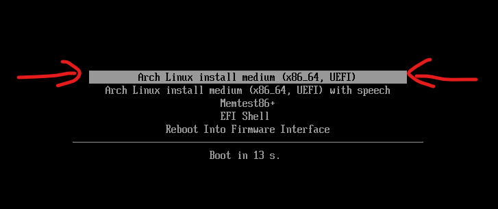

## 前言

:::caution
1. 本文默认读者学会创建VMware虚拟机，学会从网上下载ISO文件，拥有一定命令行基础，这篇教程只着重给出安装命令，之外的步骤请自行Bing/Google搜索。
2. 本篇教程少量插入图片 ~~(因为我懒)~~，有些界面得自己熟悉了qwq。
3. 本篇安装教程相比所有教程，质量比较堪忧，但最后能让你安装成功就是了（逃
:::

Arch Linux是一个基于滚动发布的Linux发行版，它的设计理念是尽可能保持简单，同时也提供足够的灵活性。Arch Linux安装在虚拟机上也十分方便，本文将介绍如何在VMware上安装Arch Linux。

本文只详细给出安装命令，具体的安装过程请参考Arch Linux官方文档。

## 准备工作

- VMware Workstation Pro 17.5.2
- Arch Linux ISO文件（推荐使用官方镜像）
- 至少4G的内存
- 至少20G的硬盘空间
- 推荐使用4个CPU核心

## 创建虚拟机

:::important
1. 虚拟机设置-硬件-网络适配器选择NAT模式，否则无法联网。
2. 虚拟机设置-高级-固件类型选择UEFI（官方文档推荐的固件选项），本篇教程不适用BIOS引导的虚拟机。
:::

这个想必大家都会了吧，就不用再费口舌教你怎么创建了（逃

创建好了之后就可以直接启动了(oﾟ▽ﾟ)o  

## 正式安装

### 启动虚拟机

启动虚拟机，进入Arch Linux安装界面。
安装界面选项选择`"Arch Linux install medium (x86_64, UEFI)"`回车。 ~~(第一个就是了直接Enter回车)~~



等它加载完就进入livecd交互tty界面了（使用getty），默认root登录

### 连接网络

一般虚拟机使用NAT模式连接网络，进入livecd自动运行dhcp连接了，但我们还得保证有没有真的连接到网络，我们输入以下命令测试连通性（下面命令框中，“#”表示注释不要跟着复制）：

```bash
ping -c4 www.baidu.com 
# 解释:向www.baidu.com发送4个包，如果收到回复，说明网络连接正常。
```

如果能ping通，说明网络连接正常。

### 禁用Reflector服务

Arch Linux LiveCD启动时会自动执行Reflector服务，这个服务会自动同步Arch Linux官方仓库，但我们不需要这个功能，所以我们禁用它。

```bash
systemctl stop reflector.service
systemctl disable reflector.service
```

记得看一下服务状态(按"q"退出查看)：

```bash
systemctl status reflector.service
```

如果服务已禁用，输出应该是`“Unit reflector.service could not be found.”`

### 磁盘手动分区

先执行`lsblk`命令查看磁盘信息：

```bash
lsblk
```

将会看到类似如下输出：

```bash
NAME   MAJ:MIN RM   SIZE RO TYPE MOUNTPOINT
loop0     7:0   0 810.1M  1 loop /run/archiso/airootfs
sda       8:0   0 133.6G  0 disk 
sr0      11:0   1   1.1G  0 rom  /run/archiso/bootmnt  
```

`sda`是我们要安装Arch Linux的磁盘，我们手动分区：

:::caution
如果不会使用cfdisk命令，可以参考Arch Linux官方文档的[分区指南](https://wiki.archlinux.org/index.php/Partitioning)。~~(或者必应搜索cfdisk怎么用)~~
:::

1. 输入`cfdisk /dev/sda`，进入磁盘分区工具。
2. 进入分区表选项，选择gpt，然后回车。
3. 不同人有不同的分区方案，由于我创建的虚拟机硬盘容量为133.6G，所以我选择了如下分区方案：
   - 800M为EFI分区
   - 125G为根目录分区
   - 剩余空间(7.8G)为swap分区
4. 光标选择"Write"回车，询问你是否将分区表写入磁盘，输入"yes"回车。
5. 光标选择"Quit"回车，退出cfdisk。

再次执行lsblk命令查看磁盘信息，输出如下：

```bash
NAME   MAJ:MIN RM   SIZE RO TYPE MOUNTPOINT
loop0     7:0   0 810.1M  1 loop /run/archiso/airootfs
sda       8:0   0 133.6G  0 disk 
├─sda1    8:1   0   800M  0 part 
├─sda2    8:2   0   125G  0 part 
└─sda3    8:3   0   7.8G  0 part 
sr0      11:0   1   1.1G  0 rom  /run/archiso/bootmnt  
```

`sda1`是EFI分区，`sda2`是根目录分区，`sda3`是swap分区。

### 格式化分区

我们需要格式化一下分区，以下是格式化分区的命令：

>（EFI分区格式化为vfat(fat32)，根分区使用ext4文件系统，swap分区使用swap文件系统）

```bash
mkfs.vfat -F32 /dev/sda1
mkfs.ext4 /dev/sda2
mkswap /dev/sda3
```
### 挂载分区

我们需要挂载分区，以下是挂载分区的命令：

```bash
mount /dev/sda2 /mnt
mount --mkdir /dev/sda1 /mnt/efi
# 这里我挂载到/mnt/efi目录下，如果将EFI分区挂载到/mnt/boot或/mnt/boot/efi目录下，也不是不行，但目前我看一些人不推荐了（
swapon /dev/sda3
```

### 安装基本系统

#### 准备
在安装基本系统之前，我们需要更换一下livecd使用的镜像源，执行以下命令：

```bash
echo 'Server = https://mirrors.bfsu.edu.cn/archlinux/$repo/os/$arch' > /etc/pacman.d/mirrorlist
echo 'Server = https://mirrors.tuna.tsinghua.edu.cn/archlinux/$repo/os/$arch' >> /etc/pacman.d/mirrorlist
echo 'Server = https://mirrors.ustc.edu.cn/archlinux/$repo/os/$arch' >> /etc/pacman.d/mirrorlist
```

执行`cat /etc/pacman.d/mirrorlist`命令，检查一下镜像源是否正确。正确的输出如下：

```bash
Server = https://mirrors.bfsu.edu.cn/archlinux/$repo/os/$arch
Server = https://mirrors.tuna.tsinghua.edu.cn/archlinux/$repo/os/$arch
Server = https://mirrors.ustc.edu.cn/archlinux/$repo/os/$arch
```

执行以下命令更新软件包数据库：

```bash
pacman -Sy
```

编辑`/etc/pacman.conf`文件，找到以下一行：

```bash
...
#ParallelDownloads = 5
...
```

将注释去掉，并将`5`改为`3`，保存并退出。

#### 安装基本系统

执行以下命令安装基本系统（可以根据电脑配置情况和个人喜好，内核和软件都可以安装）：

```bash
pacstrap /mnt base base-devel linux linux-firmware linux-zen linux-headers linux-zen-headers nano vim sudo grub efibootmgr networkmanager intel-ucode
```

#### 生成fstab文件

执行以下命令生成fstab文件：

```bash
genfstab -U /mnt >> /mnt/etc/fstab
```

记得检查一下`/mnt/etc/fstab`文件，确认一下分区输出是否正确：

```bash
cat /mnt/etc/fstab
```

看起来是这样子的


#### 切换根目录

执行以下命令切换根目录：

```bash
arch-chroot /mnt
```

### 安装后配置
#### 设置时区

设置时区前，请先启用网络时间同步，命令如下：

```bash
timedatectl set-ntp true
```

执行以下命令设置时区：

```bash
ln -sf /usr/share/zoneinfo/Asia/Shanghai /etc/localtime
hwclock --systohc
```

#### 设置locale

:::note
`vim`基本使用操作：
 - 1. `"/"`键进入搜索模式，输入要搜索的单词，回车，可以搜索到相关内容。
   2. 按`"i"`键进入编辑，`Esc`键退出编辑，
   3. `"x"`键去除文字，
   4. 输入`":wq"`保存并退出，后面加`"!"`表示强制执行。
   5. 键入`"yy"`复制行
   6. 键入`"dd"`剪切行
   7. 键入`"p"`黏贴行
   8. 键入`"d$"`复制光标后面半行
 - 目前我还不怎么熟悉使用vim，有些是从网上找来的以及某群群u说的（
 - 如果以后学会了我也会写一篇博文谈谈vim的使用技巧（画大饼.jpg）
:::

由于前面安装了vim，我们使用vim编辑`/etc/locale.gen`文件，将`"en_US.UTF-8"`和`"zh_CN.UTF-8"`前面的`"#"`号去掉，保存修改并退出，确保看起来如下：

```bash
...
en_US.UTF-8 UTF-8
...
zh_CN.UTF-8 UTF-8
...
```


然后执行以下命令：
```bash
locale-gen
echo LANG=en_US.UTF-8 > /etc/locale.conf
```

#### 设置主机名

执行以下命令设置主机名(以`"LingXi9374-ArchPC"`为例)：

```bash
echo "LingXi9374-ArchPC" > /etc/hostname
```

#### 创建用户

执行以下命令创建用户(以`"lingxi"`为例)：
```bash
useradd -m -g users -G wheel lingxi
```

#### 设置用户密码和root密码
执行以下命令设置用户密码和root密码(以`"lingxi"`为例)：

```bash
passwd lingxi
passwd root
```

#### 给予用户sudo权限

执行以下命令给予用户`sudo`权限：

```bash
EDITOR=vim visudo
#或者
vim /etc/sudoers
```

找到`# %wheel ALL=(ALL:ALL) ALL`这一行，将注释去掉，保存并退出。

再次确认一下文件修改对不对：

```bash
...
%wheel ALL=(ALL:ALL) ALL
...
```


#### 启用网络服务

执行以下命令启用`Network Manager`网络服务：

```bash
systemctl enable NetworkManager.service
```

#### 生成grub引导
执行以下命令生成`grub`引导：

```bash
grub-install --target=x86_64-efi --efi-directory=/efi --bootloader-id=GRUB --removable
```

若输出为：

```bash
Installing for x86_64-efi platform.
Installation finished. No error reported.
```

则表示安装grub引导成功。

-----

编辑`/etc/default/grub`文件，将`"GRUB_TIMEOUT=5"`修改为`"GRUB_TIMEOUT=30"`；

将`"GRUB_CMDLINE_LINUX_DEFAULT="`后面的参数修改为`"loglevel=5 nowatchdog"`
最终修改如下：

```bash
GRUB_TIMEOUT=30
GRUB_CMDLINE_LINUX_DEFAULT="loglevel=5 nowatchdog"
```

保存并退出。

生成`grub`配置文件：

```bash
grub-mkconfig -o /boot/grub/grub.cfg
```


#### 重启系统

执行以下命令退出chroot环境（或者直接按`Ctrl+D`退出chroot环境）：

```bash
exit
```

关闭`swap`:

```bash
swapoff /dev/sda3
```

取消挂载分区：

```bash
umount -R /mnt
```

重启系统：

```bash
reboot
```

在这里我们成功完成了Arch Linux的安装，接下来就开启您的Arch Linux之旅吧！

## 后续工作

敬请参阅[下一篇博文](https://lingxi9374.github.io/posts/%E6%95%99%E7%A8%8B/archconfiguration/)

（The End）